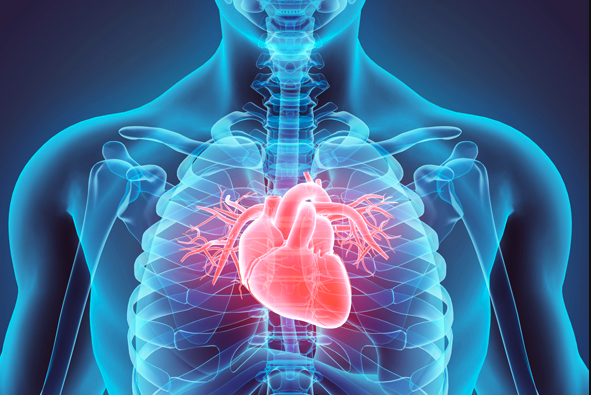

### Predicting heart disease

##### Goal: to accurately predict the likelihood of a new patient having heart disease in the future

Cardiovascular diseases (CVDs) remain a leading cause of mortality globally, with an estimated 17.9 million people succumbing to it annually.[World Health Organization (WHO)](https://www.who.int/health-topics/cardiovascular-diseases) 

The [dataset](https://www.kaggle.com/datasets/fedesoriano/heart-failure-prediction) includes relevant anonymized data from from multiple hospitals which has medical information and characteristics for each patient and includes whether or not they have had heart disease before.

I selected features for the model based on their correlation strength with heart disease.

The dataset features are:

- `Age`: age of the patient [years]
- `Sex`: sex of the patient [M: Male, F: Female]
- `ChestPainType`: chest pain type [TA: Typical Angina, ATA: Atypical Angina, NAP: Non-Anginal Pain, ASY: Asymptomatic]
- `RestingBP`: resting blood pressure [mm Hg]
- `Cholesterol`: serum cholesterol [mm/dl]
- `FastingBS`: fasting blood sugar [1: if FastingBS > 120 mg/dl, 0: otherwise]
- `RestingECG`: resting electrocardiogram results [Normal: Normal, ST: having ST-T wave abnormality (T wave inversions and/or ST elevation or depression of > 0.05 mV), LVH: showing probable or definite left ventricular hypertrophy by Estes' criteria]
- `MaxHR`: maximum heart rate achieved [Numeric value between 60 and 202]
- `ExerciseAngina`: exercise-induced angina [Y: Yes, N: No]
- `Oldpeak`: oldpeak = ST [Numeric value measured in depression]
- `ST_Slope`: the slope of the peak exercise ST segment [Up: upsloping, Flat: flat, Down: downsloping]
- `HeartDisease`: output class [1: heart disease, 0: Normal]

##### Result: a k-nearest neighbor model that has a 82% accuracy of identifying if a new patient does have heart disease.

